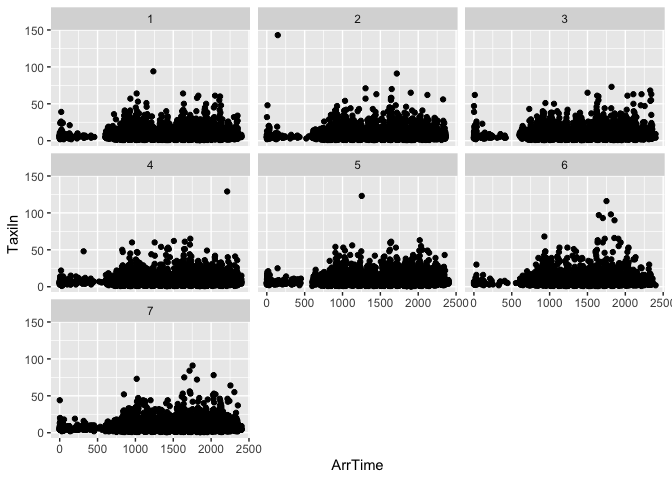
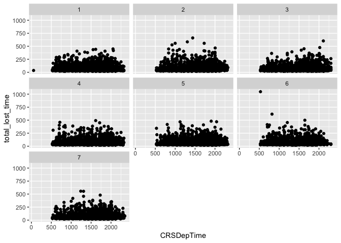
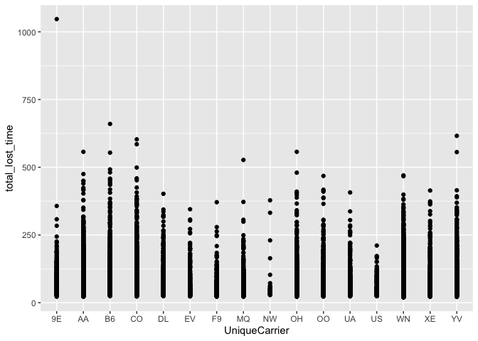
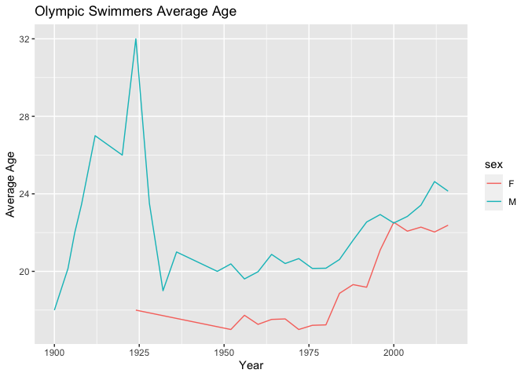
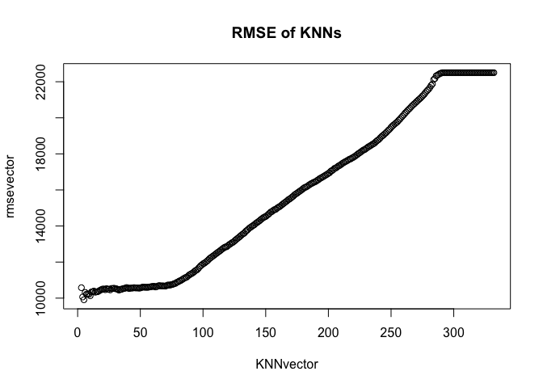
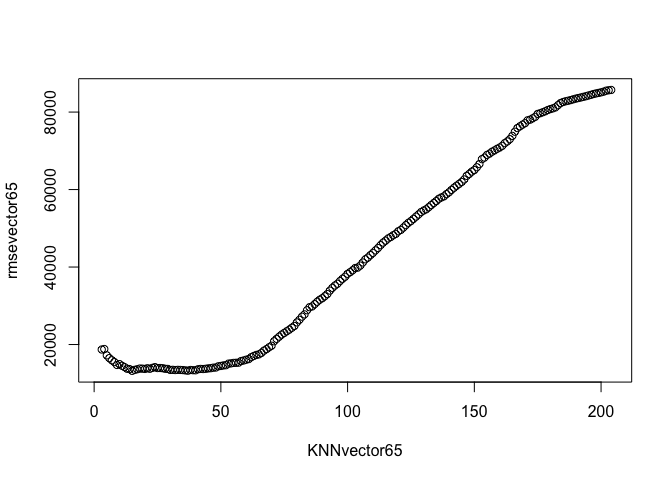
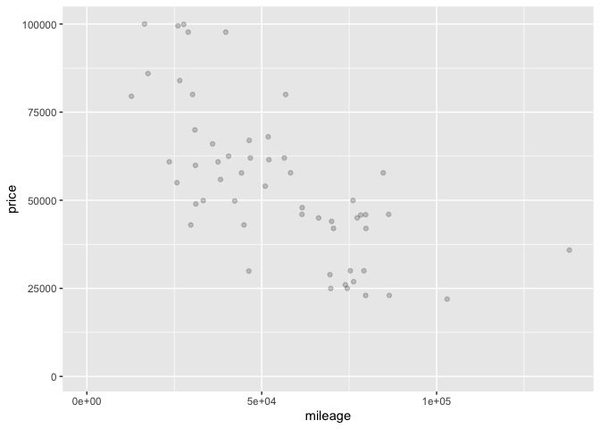
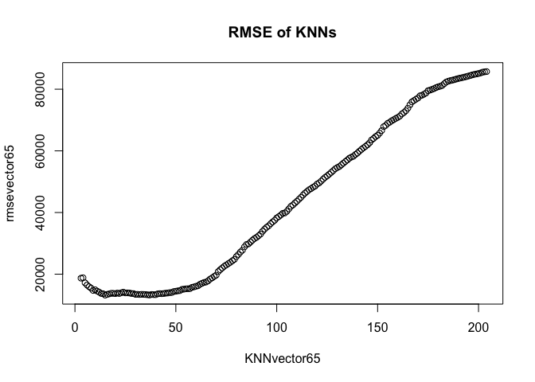

# ECO395M HOMEWORK 1

## Joseph Monahan, Saager Buch, Phillip An

    ## ── Attaching packages ─────────────────────────────────────── tidyverse 1.3.2 ──
    ## ✔ tibble  3.1.8      ✔ dplyr   1.0.10
    ## ✔ tidyr   1.3.0      ✔ stringr 1.5.0 
    ## ✔ readr   2.1.3      ✔ forcats 0.5.2 
    ## ✔ purrr   1.0.1      
    ## ── Conflicts ────────────────────────────────────────── tidyverse_conflicts() ──
    ## ✖ dplyr::filter() masks stats::filter()
    ## ✖ dplyr::lag()    masks stats::lag()
    ## Loading required package: lattice
    ## 
    ## 
    ## Attaching package: 'caret'
    ## 
    ## 
    ## The following object is masked from 'package:purrr':
    ## 
    ##     lift

    ##    Min. 1st Qu.  Median    Mean 3rd Qu.    Max.    NA's 
    ##   0.000   4.000   5.000   6.413   7.000 143.000    1567

    ## Warning: Removed 1567 rows containing missing values (`geom_point()`).

As someone who has suffered from excessive taxi in time on multiple
occasions when landing at the Austin Bergstrom Airport, I was very
interested in what days of the week and arrival times had the longest
taxi in times in 2008. I am sure this has changed drastically given the
meteoric rise in popularity of Austin within the last decade. From the
graph above we can see that it there

I was also interested in which scheduled departure times and days of the
week departures suffered the most amount of lost time from all different
forms of delays and taxi out time. I created a variable called
total\_lost\_time, summing the delay time and the taxi out time. I then
proceeded to plot this using facewrap by day of the week. From this
plot, it can be said that most time lost from delays and taxiing seems
to be during the week day evenings. One day and time that particularly
stuck out was departure time at 8 pm on Sundays. Saturdays appear to be
one of the better days to fly on.

    ## 
    ##    9E    AA    B6    CO    DL    EV    F9    MQ    NW    OH    OO    UA    US 
    ##  2549 19995  4798  9230  2134   825  2132  2663   121  2986  4015  1866  1458 
    ##    WN    XE    YV 
    ## 34876  4618  4994

To analyze which carries made passengers suffer the most time lost, the
graph above plots the Carries against the total lost time. It seems like
JetBlue (B6), Continental (CO), and American Airlines (AA) all have more
lost time than the rest of the airlines. It should be noted that
American Airlines had the second most amount of flights, while Jet Blue
had far less flights.

    ## 95% 
    ## 183

The 95% of heights for female competitors across all Athletics events is
183 cm.

    ## # A tibble: 132 × 2
    ##    event                                 sdheight
    ##    <chr>                                    <dbl>
    ##  1 Rowing Women's Coxed Fours               10.9 
    ##  2 Basketball Women's Basketball             9.70
    ##  3 Rowing Women's Coxed Quadruple Sculls     9.25
    ##  4 Rowing Women's Coxed Eights               8.74
    ##  5 Swimming Women's 100 metres Butterfly     8.13
    ##  6 Volleyball Women's Volleyball             8.10
    ##  7 Gymnastics Women's Uneven Bars            8.02
    ##  8 Shooting Women's Double Trap              7.83
    ##  9 Cycling Women's Keirin                    7.76
    ## 10 Swimming Women's 400 metres Freestyle     7.62
    ## # … with 122 more rows

The women’s event had the greatest variability in competitor’s heights
as measured by the standard deviation is Rowing Women’s Coxed Fours with
a standard deviation of 10.9.

 The graph above shows
that the average age is relatively stable from approximately 1940 until
around 1980. After 1980, the average age begins to rise for both men and
women, but women’s average age appears to increase at a faster rate
especially in the 1990’s.

The smallest RMSE value 9529.109 which belongs to the 13th nearest
neighbor.

    ## integer(0)

    split65 =  initial_split(Trim65AMG, prop=0.7)
    train_65 = training(split65)
    test_65  = testing(split65)

    ## [1] 13206.66

    ## [1] NA

The smallest RMSE value 13206.66 which belongs to the 15th nearest
neighbor.

    ## [1] 13206.66

    ## integer(0)
